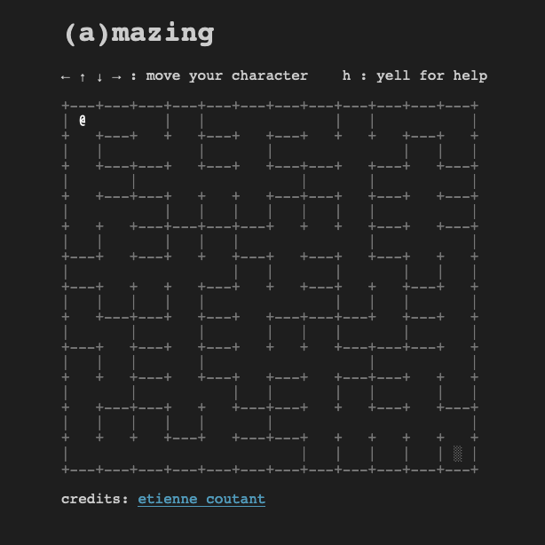
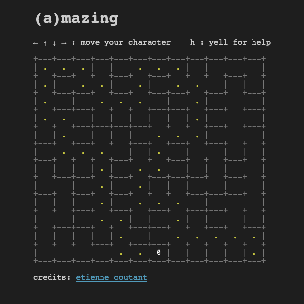

# (a)mazing

A tiny maze generator written in JavaScript based on classical algorithms: binary tree, sidewinder and backtracker.

Try the live [demo](https://oliviernocent.github.io/a-mazing/).

---

Credits: [Etienne Coutant](https://iut-info.univ-reims.fr/users/coutant/Creation_Resolution_Labyrinthe_Sujet.html)
